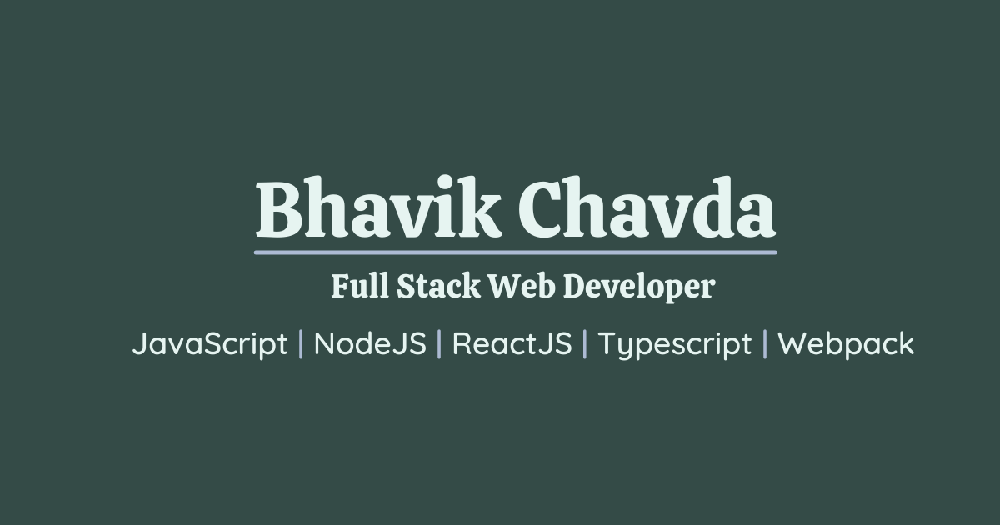

# Hey 👋, I'm Bhavik Chavda
> ### I develop websites, create content and likes meeting people.

---

## 🤓 Bit about me

- 🔭 I’m currently working on Node, React and learning new everyday
- 🌱 I spent most of time in reading books and writing code
- 💬 I can help you in **Node**, **React**, **Accessibility**, **Security**, **SEO** and in **Web-Performance**

## 🥇 Some of my Achievements
- Spoke as a Host in college Annual Function
- Gave a talk on **Web-Security** at community and in college
- Posted **20+** posts on web-development in LinkedIn
- Actively handled Responsibility of Class Representative for six months
- Participated in Hackathon and Developed IoT-based water monitoring solution for monitoring and analyzing water consumption

## 📔 I likes to share content

> I likes to share posts on topics like **Web-Development**, **Web-Performance**, **JavaScript**, **Accessibility** and **SEO**

➡️ [Read all posts...](https://www.bhavikchavda.com/content)

## 📕 I ocassionally write blogs too

<!-- BLOG-POSTS-LIST:START -->
- [Create dynamic theme in react](https://bhavikchavda.hashnode.dev/step-by-step-guide-on-creating-a-dynamic-theme-in-react-thats-color-changes-based-on-user-selection)
<!-- BLOG-POSTS-LIST:END -->

➡️ [View all posts...](https://bhavikchavda.hashnode.dev/)

---

